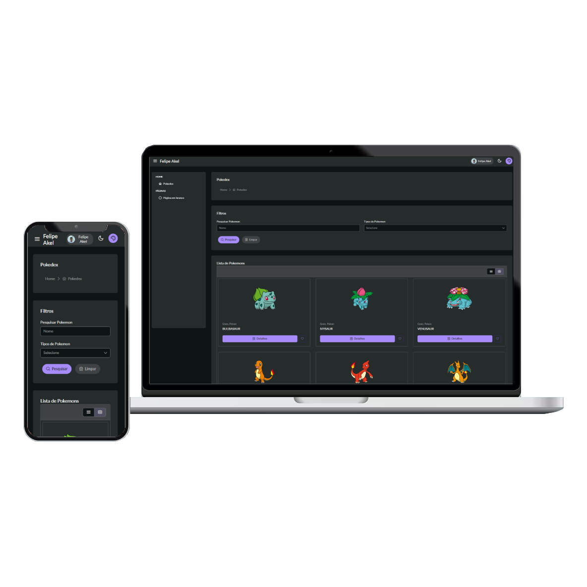

<p align="center"></p>

<p align="center"><a href="https://felipeakel.github.io/Angular-API-Pokedex/" target="_blank" ><b>Visualize o sistema com o GitHub Pages</b></a></p>

## :rocket: Sobre o API Pokedex em Angular

O API Pokedex trata-se de um website desenvolvido no framework front-end, Angular, com o objetivo consumir dados de uma API REST e gerenciar uma lista de Tarefas (criando, editando, excluindo entre outras ações). O sistema contém uma arquitetura de componentes modularizados e escalavel. Dessa forma, padrões de boas práticas e Teste Unitário foram importantes para atingir essa qualidade.

Destaca-se, que o sistema é composto de bibliotecas consolidadas no mercado de trabalho e compatíveis com as últimas versões do Angular. Com isso, garante uma uniformidade do template dos componentes criados e a confiabilidade de layouts responsivos para dispositivos móveis e desktops.

### :small_blue_diamond: Layout Sistema
- [Pokedex](src/assets/image/readme/Pag-Pokedex.png)
- [Detalhes Pokemon](src/assets/image/readme/Pag-Detalhes.png)
- [MSN Erro de API Pokemon](src/assets/image/readme/Pag-Detalhes-Error.png)
- [Cadastro de Tarefa](src/assets/image/readme/Pag-Cadastrar-Tarefa.png)
- [Lista de Tarefa](src/assets/image/readme/Pag-Lista-Tarefas.png)
- [Testes Unitários](src/assets/image/readme/Pag-Testes-Unitarios.png)
- ...

### :small_blue_diamond: Cobertura de Testes Unitários
- [All files](https://felipeakel.github.io/Angular-API-Pokedex/pages/unit-tests)
    - Statements   : 97.77% ( 395/404 )
    - Branches     : 96.24% ( 128/133 )
    - Functions    : 95.08% ( 116/122 )
    - Lines        : 97.68% ( 380/389 )

## :computer: Tecnologias utilizadas

### :small_blue_diamond: Angular
[Angular Versão 19](https://v19.angular.dev/)

### :small_blue_diamond: PrimeNG
[PrimeNG](https://primeng.org/) biblioteca de componentes UI - User Interface.

### :small_blue_diamond: PrimeFlex
[PrimeFlex](https://primeflex.org/) biblioteca de utilitários CSS.

## :white_check_mark: Construção do Ambiente Local

Primeiramente, é essencial clonar o repositório para sua máquina e abrir o terminal, prompt de comando, no diretório na pasta do projeto. Com isso, podemos seguir o passo a passo a seguir:

### :one: Configurando o Ambiente

1. No terminal execute ```npm install```;
2. No terminal execute ```ng serve```;
3. Pronto! Você deve conseguir acessar o endereço criado (```http://localhost:4200/```) ou na porta configurada.

### :two: Para executar os Testes Unitários

Para executar os Testes Unitários do sistema.

1. No terminal execute ```ng test --code-coverage```
2. Pronto! Você deve conseguir acessar o endereço criado (```http://localhost:9876/```) ou na porta configurada.

## :unlock: Vulnerabilidades de segurança

Se você descobrir uma vulnerabilidade de segurança do sistema, envie uma mensagem para Felipe Akel via [Linkedin](https://www.linkedin.com/in/felipe-akel-carvalho-florentino-009412135/). Todas as vulnerabilidades de segurança serão verificadas. Obrigado!

## :page_facing_up: Licença

Este Projeto foi desenvolvido em Angular e utiliza a licença MIT.